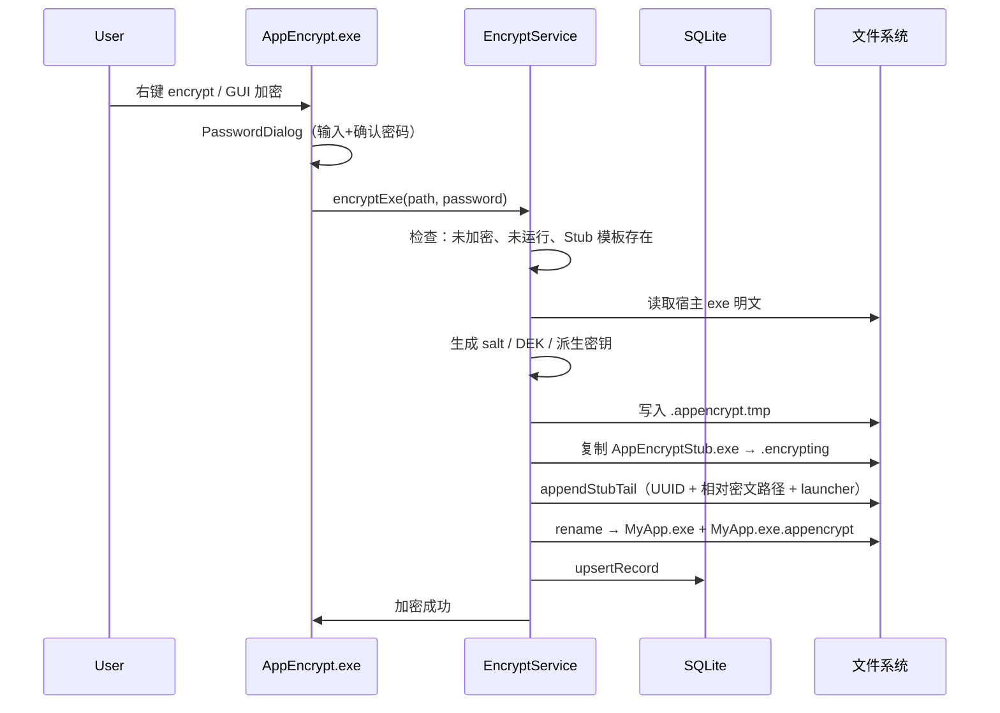
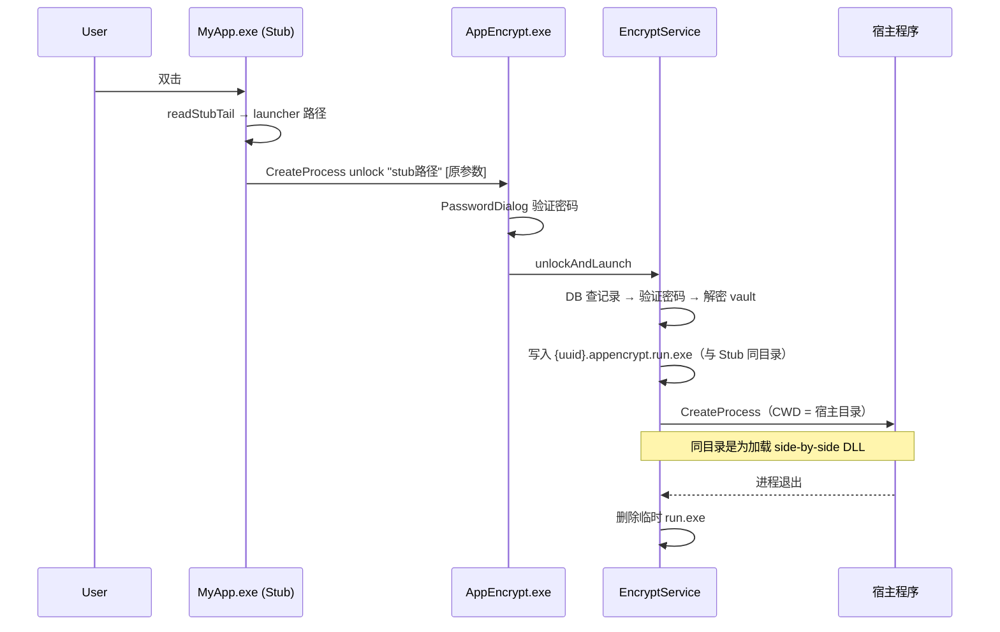

# AppEncrypt — 项目实现说明

| 文档版本 | v1.0 |
|---------|------|
| 更新日期 | 2026-07-15 |
| 适用代码 | AppEncrypt 1.0.0 MVP |

本文档面向开发者，详细说明 AppEncrypt 的**架构设计、模块职责、数据格式与核心流程**。与《需求说明书》《技术确认纪要》配套阅读。

---

## 1. 产品概述

AppEncrypt 是 Windows 平台的第三方 exe 加密工具。加密后，用户双击的仍是原文件名（实际为轻量 Stub），需输入密码后才会解密并启动真正的宿主程序。卸载 AppEncrypt 时，所有已加密程序自动还原为原始 exe。

**核心特性：**

- 右键菜单 / 主界面 / 命令行多种入口
- 本地 SQLite 管理加密元数据
- AES-256-GCM 加密宿主二进制
- 通用 Stub + 尾部配置块，无需为每个程序单独编译启动器
- Inno Setup 安装包，安装/卸载自动化

---

## 2. 总体架构

### 2.1 二进制组件

| 组件 | 技术栈 | 职责 |
|------|--------|------|
| `AppEncrypt.exe` | C++17 + Qt6 Widgets | 主程序：GUI、CLI、加密/解密/改密/unlock、右键注册、卸载还原 |
| `AppEncryptStub.exe` | C++17 + Win32（无 Qt） | 加密时复制并替换宿主文件名；双击时调用主程序 `unlock` |
| `appencrypt_core.lib` | C++17 静态库 | 核心业务：配置、加密、数据库、文件布局、进程、Shell 注册 |
| `sqlite3.lib` | C amalgamation | 本地数据库 |

### 2.2 逻辑分层

```
┌─────────────────────────────────────────────────────────┐
│  入口层   main.cpp / stub_main.cpp                       │
├─────────────────────────────────────────────────────────┤
│  交互层   MainWindow / PasswordDialog / ProgressDialog   │
│           CommandLineParser                              │
├─────────────────────────────────────────────────────────┤
│  业务层   EncryptService / ShellRegistration             │
├─────────────────────────────────────────────────────────┤
│  基础层   CryptoService / Database / FileLayout          │
│           AppConfig / ProcessUtil                        │
├─────────────────────────────────────────────────────────┤
│  系统层   BCrypt / DPAPI / SQLite / Win32 Registry       │
└─────────────────────────────────────────────────────────┘
```

### 2.3 工程目录

```
appEncrypt/
├── CMakeLists.txt              # 主工程：AppEncrypt + appencrypt_core + sqlite3
├── README.md
├── docs/                       # 文档
├── src/
│   ├── main.cpp                # Qt 入口，CLI 分发
│   ├── cli/CommandLineParser.* # 命令行解析
│   ├── core/                   # 核心业务（静态库）
│   │   ├── AppConfig.*         # config.ini 读写
│   │   ├── CryptoService.*     # BCrypt / DPAPI
│   │   ├── Database.*          # SQLite 封装
│   │   ├── EncryptService.*    # 加密/解密/unlock/卸载还原
│   │   ├── FileLayout.*        # 伴生文件、Stub 尾部块
│   │   ├── ProcessUtil.*       # 进程检测与启动
│   │   └── ShellRegistration.* # 注册表右键菜单
│   └── ui/                     # Qt 界面
├── stub/stub_main.cpp          # 轻量 Stub（独立 target）
├── third_party/sqlite/         # sqlite3 amalgamation
├── scripts/                    # 构建与辅助 bat 脚本
├── installer/AppEncrypt.iss    # Inno Setup
└── dist/                       # 打包输出（staging / 安装包）
```

---

## 3. 运行时文件布局

加密 `C:\Apps\MyApp.exe` 后：

```
C:\Apps\
├── MyApp.exe                          ← Stub（含尾部配置块）
├── MyApp.exe.appencrypt               ← 宿主二进制密文包
└── {uuid}.appencrypt.run.exe          ← unlock 时临时生成，退出后删除

C:\Program Files\AppEncrypt\
├── AppEncrypt.exe
├── AppEncryptStub.exe                 ← 加密时复制的模板
├── appencrypt.db                      ← 加密记录
├── config.ini                         ← 本地配置
└── Qt6*.dll / platforms/ ...          ← Qt 运行库

C:\ProgramData\AppEncrypt\
├── config.ini                         ← 全局备用（Stub 找不到内嵌路径时使用）
└── logs\                              ← 日志目录（预留）
```

**路径绑定规则：** 数据库以宿主 **绝对路径** 作为唯一键。移动或复制加密后的 exe 将导致 unlock/解密失败（设计如此，见《技术确认纪要》）。

---

## 4. 加密与数据结构

### 4.1 密钥体系

```
用户密码
   │
   ▼ PBKDF2-HMAC-SHA256（100,000 次）
   ├── encryptionKey (32B)  → 包裹 DEK、验证改密
   └── passwordVerifier (32B) → 仅存哈希材料，不存明文密码

DEK (32B 随机) → AES-256-GCM 加密宿主 exe 全文
                → DPAPI 额外保护一份（供卸载还原，无需用户密码）
```

| 参数 | 值 |
|------|-----|
| 密码最小长度 | 6 |
| PBKDF2 迭代 | 100,000 |
| 对称算法 | AES-256-GCM |
| 盐长度 | 16 字节 |
| Nonce | 12 字节 |
| GCM Tag | 16 字节 |

实现见 `src/core/CryptoService.cpp`（Windows CNG / BCrypt + CryptProtectData）。

### 4.2 密文包格式（`.appencrypt`）

```
┌──────────────────────────────────────┐
│ VaultPayloadHeader (28 bytes)        │
│   nonce[12]                          │
│   tag[16]                            │
├──────────────────────────────────────┤
│ ciphertext (宿主 exe 明文经 DEK 加密) │
└──────────────────────────────────────┘
```

读写逻辑：`EncryptService::writeVault` / `readVaultPlain`。

### 4.3 数据库存储（`appencrypt.db`）

表 `encrypted_files`：

| 字段 | 类型 | 说明 |
|------|------|------|
| id | TEXT PK | UUID，与 Stub 尾部块一致 |
| original_path | TEXT UNIQUE | 加密后 exe 绝对路径 |
| vault_path | TEXT | 密文包绝对路径 |
| file_size | INTEGER | 原始大小 |
| file_hash | TEXT | SHA-256（十六进制） |
| salt | BLOB | PBKDF2 盐 |
| password_verifier | BLOB | 密码验证材料 |
| password_wrapped_dek | BLOB | DEK 经 encryptionKey 包裹 |
| dpapi_wrapped_dek | BLOB | DEK 经 DPAPI 保护（卸载还原用） |
| cipher_version | INTEGER | 当前为 1 |
| status | TEXT | `active` |
| created_at / updated_at | INTEGER | Unix 时间戳 |

DEK 包裹格式与密文包类似：28 字节头 + 密文。

### 4.4 Stub 尾部配置块（v2）

追加在 Stub PE 文件**末尾**（扫描最后 4KB 查找魔数）：

```
偏移   长度        内容
────   ────        ────
+0     6           魔数 "APPENC"
+6     1           版本号（1 或 2）
+7     4           recordId 长度 (uint32 LE)
+11    idLen       recordId (UUID 字符串)
       4           vaultRelativePath 长度
       vaultLen    相对路径，如 "MyApp.exe.appencrypt"
[v2]   4           launcherExePath 长度
[v2]   launcherLen AppEncrypt.exe 绝对路径
```

- **v1**：无 launcher 路径，Stub 读 `%ProgramData%\AppEncrypt\config.ini`
- **v2**（当前）：加密时写入 `AppConfig::mainExePath()`，Stub 优先使用

实现：`FileLayout::appendStubTail` / `readStubTail`；Stub 侧见 `stub/stub_main.cpp`。

---

## 5. 核心流程

### 5.1 加密（encrypt）



**原子性：** 使用 `.encrypting` / `.tmp` 临时文件，任一步失败则清理临时文件，不破坏原 exe。

### 5.2 双击启动（unlock）



**启动细节（`ProcessUtil::launchAndWait`）：**

- 解密临时 exe 必须放在 **Stub 同目录**（非 `%TEMP%`），否则无法加载同目录 DLL
- 工作目录（CWD）设为宿主原目录
- 命令行参数原样转发
- 若 `CreateProcess` 返回需提权（错误码 740），自动 `ShellExecuteEx` + `runas` 弹出 UAC
- 失败时返回 UTF-8 中文错误 + Windows 错误码

### 5.3 解密（decrypt）

用户主动解密（非 unlock）：

1. 验证密码
2. 从 vault 解密出原始二进制
3. 删除 `.appencrypt` 密文包
4. 用明文覆盖 Stub exe
5. 删除 DB 记录

### 5.4 更改密码（changepw）

1. 验证旧密码，unwrap DEK
2. 新 salt + 新 PBKDF2 → 更新 verifier 与 wrapped DEK
3. **不重新加密 vault**（DEK 不变，密文包不变）

### 5.5 卸载还原（uninstall-restore）

Inno Setup `[UninstallRun]` 调用：

1. 遍历 DB 全部 `active` 记录
2. 用 **DPAPI** 解包 DEK（无需用户密码）
3. 解密 vault → 写回 `original_path`
4. 删除 vault、删除 DB 记录
5. 单条失败跳过并汇总

---

## 6. 模块说明

### 6.1 入口与 CLI（`main.cpp` / `CommandLineParser`）

| 命令 | 行为 |
|------|------|
| （无参数） | 打开 MainWindow GUI |
| `encrypt / decrypt / changepw <exe>` | 弹密码框 + 执行业务 |
| `unlock <stub> [args...]` | 弹密码框 + unlockAndLaunch |
| `register-shell [--system]` | 注册表右键（HKCU 或 HKLM） |
| `unregister-shell [--system]` | 移除右键 |
| `uninstall-restore [--quiet]` | 批量还原 |
| `<file.exe>` | SendTo 快捷方式：等同 encrypt |

### 6.2 配置（`AppConfig`）

安装目录下 `config.ini` 示例：

```ini
[Paths]
InstallDir=auto
MainExe=C:\Program Files\AppEncrypt\AppEncrypt.exe
Database=appencrypt.db
StubTemplate=AppEncryptStub.exe
LogDir=%ProgramData%\AppEncrypt\logs

[Security]
MaxFailedAttempts=5
LockoutMinutes=5
```

首次运行 `load()` 时若不存在则 `save()` 生成，并同步 `MainExe` 到 `%ProgramData%\AppEncrypt\config.ini`。

### 6.3 右键菜单（`ShellRegistration`）

注册表位置：

- 当前用户：`HKCU\Software\Classes\exefile\shell\AppEncrypt.*`
- 系统级（`--system`）：`HKLM\Software\Classes\exefile\shell\AppEncrypt.*`

每项 command 形如：

```
"C:\Program Files\AppEncrypt\AppEncrypt.exe" encrypt "%1"
```

### 6.4 UI 层

| 组件 | 说明 |
|------|------|
| `MainWindow` | 选文件/拖拽、加密/解密/改密、注册右键 |
| `PasswordDialog` | 三种模式：Encrypt（双密码）、Verify、ChangePassword |
| `ProgressDialog` | 加密进度条 |

`PasswordDialog` 按模式**只创建需要的输入框**，避免未加入 layout 的控件叠在左上角。

### 6.5 Stub（`stub/stub_main.cpp`）

- 无 Qt 依赖，体积极小
- 读取自身 PE 尾部配置
- 定位 `AppEncrypt.exe`（内嵌路径 → global config.ini）
- `CreateProcessW` 调用 `AppEncrypt.exe unlock "<stub路径>" [转发参数]`
- 等待主程序退出并返回其退出码

---

## 7. 构建与脚本

### 7.1 CMake Target

| Target | 输出 |
|--------|------|
| `AppEncrypt` | `build/Release/AppEncrypt.exe` |
| `AppEncryptStub` | `build/stub/Release/AppEncryptStub.exe`（post-build 复制到主程序旁） |
| `appencrypt_core` | 静态库 |
| `sqlite3` | 静态库 |

编译选项：MSVC `/W4 /utf-8`；C++17。

### 7.2 辅助脚本（`scripts/`）

| 脚本 | 用途 |
|------|------|
| `fetch_sqlite.bat` | curl 下载 sqlite amalgamation |
| `build_installer.bat` | staging + windeployqt + ISCC |
| `register_shell.bat` | 注册右键（可选 InstallDir、`--system` 提权） |
| `unregister_shell.bat` | 移除右键 |
| `install_sendto.bat` | 创建「发送到」快捷方式 |
| `create_shortcut.vbs` | SendTo 链接辅助 |

`build_installer.bat` 参数：`[QtDir] [AppVersion] [Configuration] [IsccPath]`

### 7.3 安装包（Inno Setup）

`installer/AppEncrypt.iss` 关键行为：

- 安装后：`register-shell --quiet`
- 卸载前：`uninstall-restore --quiet` → `unregister-shell --quiet`
- 删除 `%ProgramData%\AppEncrypt`

---

## 8. 安全与边界

### 8.1 已实现的防护

- 不存储明文密码
- 加密前检测 exe 是否正在运行
- 加密使用临时文件 + rename，失败可回滚
- unlock 临时 exe 用后删除

### 8.2 已知限制（MVP）

| 限制 | 说明 |
|------|------|
| 路径绑定 | 移动/复制加密 exe 后失效 |
| 仅保护 exe 本体 | 不加密同目录 DLL、配置文件、资源 |
| 本地安全模型 | 具备管理员权限或 DB 文件访问权限的攻击者可绕过 |
| 无代码签名 | SmartScreen 可能拦截新写入的临时 exe |
| 架构 | 仅 x64 |
| 批量加密 | 未实现多选右键 |
| 失败次数锁定 | config.ini 有配置项，业务层尚未完全接入 |

### 8.3 常见问题排查

| 现象 | 可能原因 | 处理 |
|------|----------|------|
| 密码正确但程序不启动 | 旧版写入 TEMP 导致缺 DLL | 升级至最新版（同目录 run.exe） |
| 启动失败 + 错误码 740 | 宿主需管理员 | 新版本自动 UAC 提权 |
| 启动失败 + 错误码 5 | 权限/杀软拦截 | 检查目录权限、白名单 |
| 未找到加密记录 | exe 被移动或 DB 损坏 | 在原路径操作或手动 decrypt |
| 乱码错误信息 | 旧版编码问题 | 已修复为 UTF-8 |

---

## 9. 扩展方向

- 失败次数锁定（`MaxFailedAttempts` / `LockoutMinutes`）
- 加密前自动备份
- 多选批量加密
- 代码签名（安装包 + 临时 run.exe）
- 路径变更检测与 repair 工具
- x86 支持

---

## 10. 相关文档

- [需求说明书](需求说明书.md) — 功能与非功能需求
- [技术确认纪要](技术确认纪要.md) — 技术决策摘要
- [构建与部署手册](构建与部署手册.md) — 编译、打包、安装、卸载
- [README](../README.md) — 快速入门

---

*文档随代码演进更新；若与源码不一致，以源码为准。*
